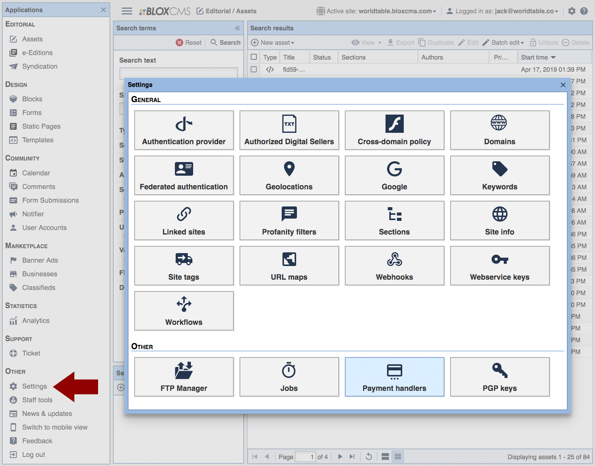
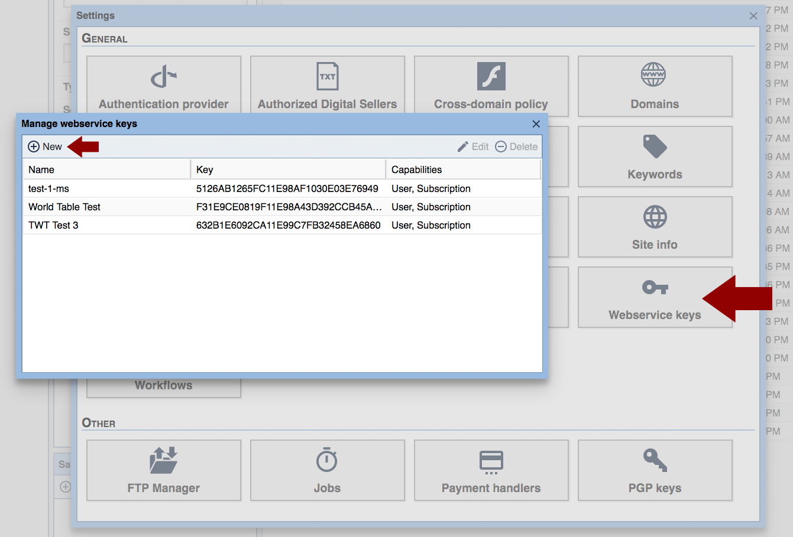
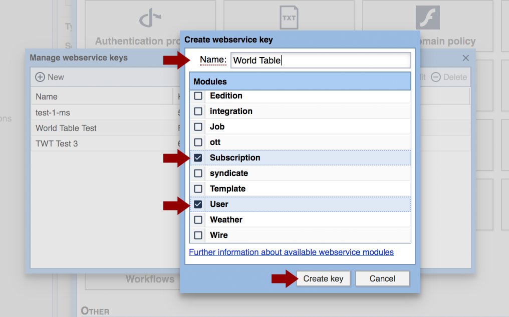
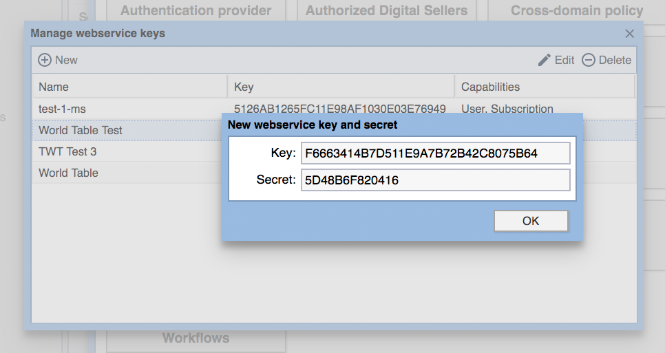
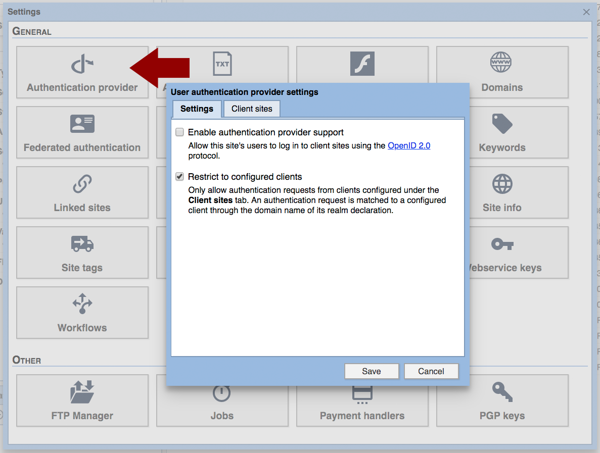
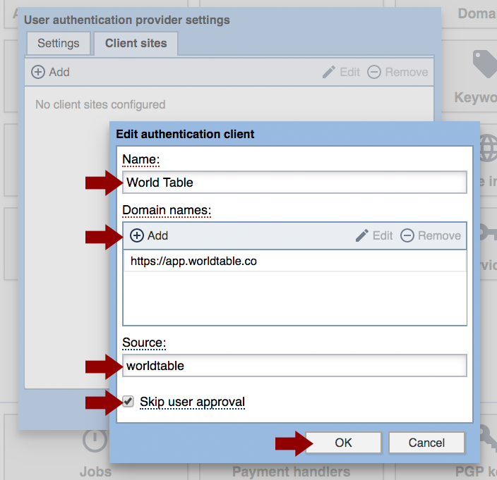

## Enabling World Table Single Sign On (SSO) in TownNews.com BLOX CMS

### Quickstart

Step 1) World Table must be enabled as a “Webservice keys” provider. This step is completed by going to “Settings” > “Webservice Keys” and clicking on “New.”

Step 2) In the form that opens, enter the name “World Table” and check “Subscription” and “User.” Then click “Create Key.”

Step 3) Both the Key and Secret must be entered in the New Site provisioning form, and/or sent to World Table staff, so that your site can be configured in the World Table backend.

Step 4) Click “OK.” “World Table” will now appear under the list of “webservice keys” for your site.

Step 5) Next, under “Settings” > “Authentication Provider” if your site has “Restrict to configured clients” checked, then World Table will need to be included as a client.

Step 6) To add World Table as a client, click on the “Client sites” tab (see above image), then click “Add.” Type “World Table” under Name then click “Add” and type in the domain: “https://app.worldtable.co”
Set “Source” as “worldtable” and check the “Skip user approval” option.

Click "OK"
